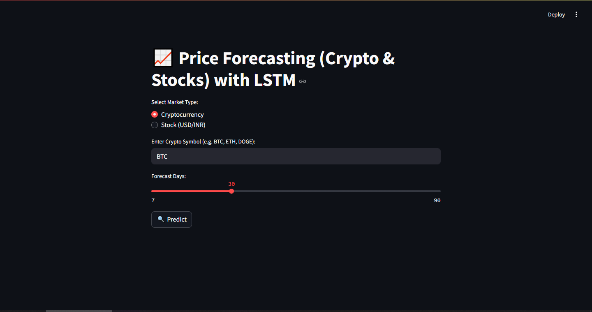
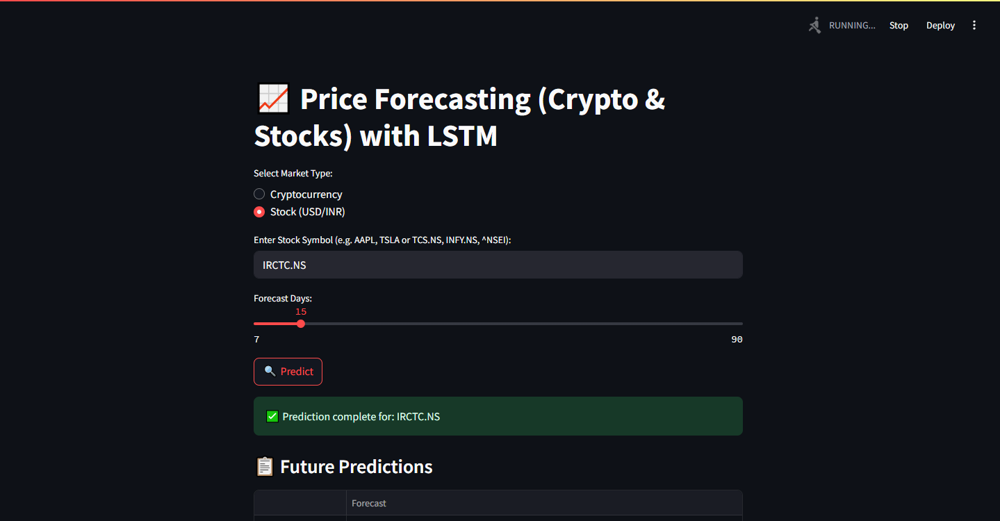
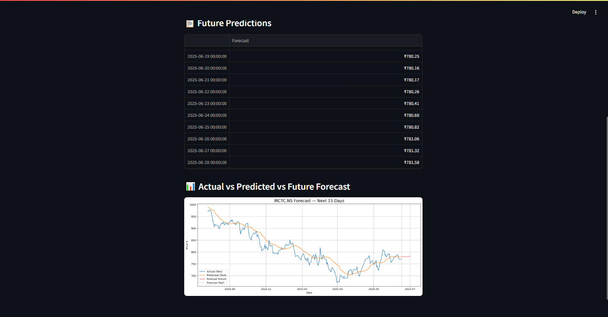

# 📈 Market Forecasting App (Crypto & Stocks)

Welcome to **Market Forecast (Crypto & Stocks)** — a powerful LSTM-based forecasting tool built with **Python**, **Streamlit**, **TensorFlow**, and **Yahoo Finance API**. This app allows users to predict future prices of **cryptocurrencies** and **stocks (USD/INR)** in an intuitive and interactive way.

---

## 🚀 Features

- 🔄 **Real-time data** fetched from Yahoo Finance
- 📊 Predict prices for **Cryptos** (e.g., BTC, ETH) or **Indian/US Stocks** (e.g., TCS.NS, AAPL)
- 📅 Adjustable **forecast range** (7 to 90 days)
- 🧠 **LSTM Neural Network** for sequential prediction
- 📈 Beautifully plotted **Actual vs Predicted vs Future Forecast** graphs
- 💵 Supports **INR (₹)** for NSE stocks and **USD ($)** for crypto/US stocks
- ❌ Handles errors for invalid tickers and missing data gracefully

---

## 🖼️ Screenshot

 <br><br>

 <br><br>

 <br><br>

---

## 🛠️ Tech Stack

- Python
- Streamlit
- TensorFlow / Keras
- yFinance
- Scikit-learn (MinMaxScaler)
- Matplotlib
- Pandas / NumPy

---

## 💡 How It Works

1. User selects **Crypto or Stock**
2. Enters a ticker (e.g., BTC, TCS.NS)
3. Chooses forecast duration (7–90 days)
4. The model:
   - Trains an LSTM on historical closing prices
   - Predicts future prices day-by-day
   - Plots predictions with interactive charts
5. Outputs a 📋 table + 📊 visual analysis

---

## ✅ Example Tickers

| Type | Example Symbols |
|------|-----------------|
| Cryptocurrency | `BTC`, `ETH`, `DOGE`, `AVAX` |
| NSE India Stocks | `TCS.NS`, `INFY.NS`, `IRCTC.NS`, `^NSEI` |
| US Stocks | `AAPL`, `TSLA`, `GOOGL` |

---

## 📌 Note

- This is Phase 1 of the project. More enhancements like **UI upgrades**, **news sentiment analysis**, and **tweet trends** are planned for upcoming phases.

---

## 📥 Run It Locally

```bash
git clone https://github.com/syedamashs/Market-Forecast.git
cd Market-Forecast
pip install -r requirements.txt
streamlit run Market_Forecast_(Crypto & Stocks).py

```

## 🙌 Author

Developed by SYED AMASH S<br>
📧 Reach out: [Syed-Amash-LinkedIn](https://linkedin.com/in/syed-amash-s-457580356) | syedamash.tce@gmail.com
